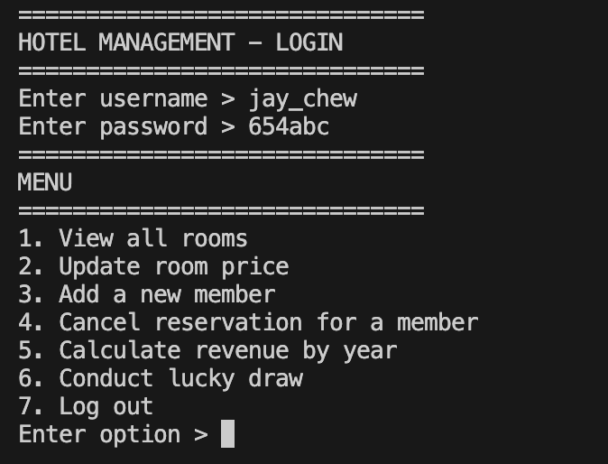

# 🏨 Hotel Management System (Java Console App)

📍 **A Java console application for hotel administrators to manage rooms, members, and reservations.**

---

## **🔍 Overview**

A command-line program designed for hotel staff to:

- Track room availability and pricing.
- Manage member registrations and reservations.
- Analyze yearly revenue and conduct promotional lucky draws.

Built with **Java** for a lightweight, terminal-based workflow.

---

## **✨ Key Features**

- **Room Management**: View/update room prices (Premier, Deluxe, Family tiers).
- **Member Operations**: Add new members (Basic/Silver/Gold tiers) with auto-generated IDs.
- **Reservation Control**: Cancel bookings (non-refundable) via member ID, room number, and date.
- **Revenue Analysis**: Calculate yearly earnings based on departure dates.
- **Lucky Draw**: Randomly select a Silver/Gold tier member for promotions.

---

## **🛠️ Tech Stack**

- **Language**: Java
- **Tools**: Eclipse
